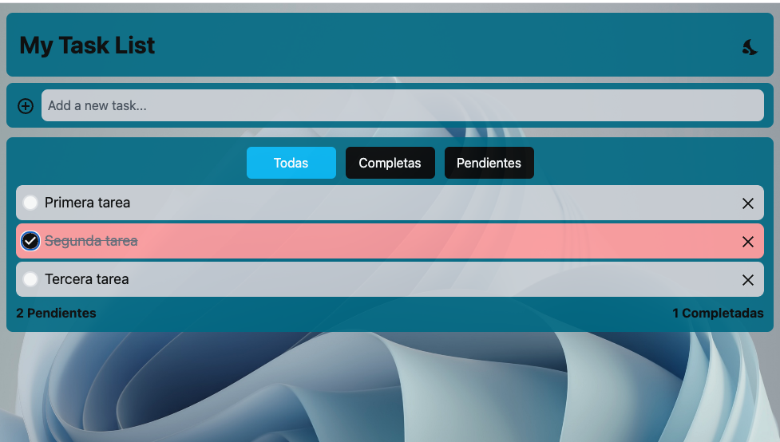

# My Task List

Primera aplicación web con React, Vite y TailwindCSS.
Esta es una aplicación web de registro de tareas, la cual, cuenta con las siguientes funcionalidades:

- Modo claro / oscuro
- Drag and drop
- Filtro de tares (todas / terminadas / pendientes)
- responsive
- Mensajes popUp



<p align="center">
    
  &nbsp;
    
  &nbsp;
    
</p>

Puedes descargar el proyecto clonando el repositorio e instalar las dependencias para poder modificarlos a gusto. Para ello, necesitas hacer lo siguiente:

- Clonar el repositorio
- Instalar dependencias
- Inicializar el proyecto

Para intalar las depencecias, luego de clonar el proyecto, utilizar los sigeuietes comandos en la terminal:

**Ingresar a la carpeta del proyecto**

```
cd myTaskList/
```

**Instalar las dependencias**

```
npm install
```

**Inicializar el proyecto**

```
npm run dev
```
