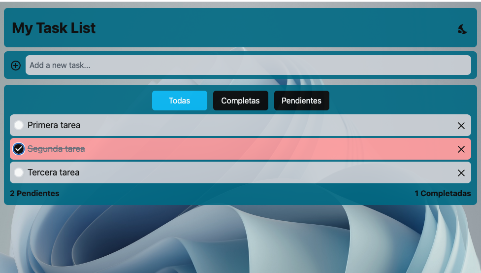

# My Task List

Primera aplicación web con React, Vite y TailwindCSS.
Esta es una aplicación web de registro de tareas, la cual, cuenta con las siguientes caracteristicas:

- Modo claro / oscuro
- Drag and drop
- Filtro de tares (todas / terminadas / pendientes)
- responsive
- Mensajes popUp

<p align="center">
    
  &nbsp;
    
  &nbsp;
    
  &nbsp;
    
</p>



## Descarga y uso

Puedes descargar el proyecto clonando el repositorio e instalar las dependencias para poder modificarlos a gusto. Para ello, necesitas hacer lo siguiente:

- Clonar el repositorio

```
git clone https://github.com/svtech-code/myTaskList.git
```

- Acceder a la carpeta e instalar las dependencias con *npm*

```
cd myTaskList/
npm install
```

- Inicializar el proyecto

```
npm run dev
```
