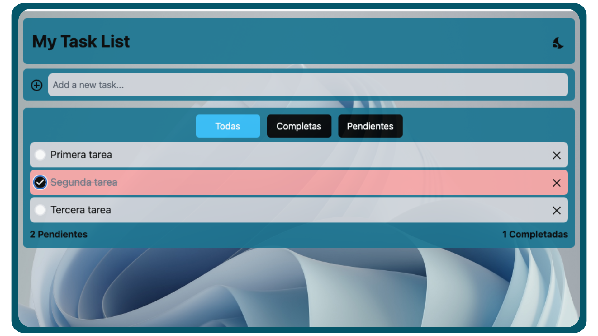

<p align="center">
  
</p>

<p align="center">
  <h1 align="center">My Task List</h1>
</p>

<div align="center">
  &nbsp;
  &nbsp;
  &nbsp;
  
</div>




## 📑 Descripción
Primera aplicación web con React, Vite y TailwindCSS, creada luego de aprender react.
Esta es una aplicación web de registro de tareas, la cual, cuenta con las siguientes caracteristicas:
- Modo claro / oscuro
- Drag and drop
- Filtro de tares (todas / terminadas / pendientes)
- responsive
- Mensajes popUp

<br>

## 🛠️ Stack
- [React](https://react.dev)
- [TailwindCSS](https://tailwindcss.com)
- [SweetAlert 2](https://sweetalert2.github.io)
- [Drag and Drop](https://www.npmjs.com/package/@hello-pangea/dnd)

<br>

## 💻 Uso del repositorio
Para utilizar este repositorio de manera funcional, debes considerar lo siguiente:

### 1. Clona el repositorio
```
git clone https://github.com/svtech-code/myTaskList.git
```

### 2. Accede al directorio del proyecto
```
cd myTaskList
```

### 3. Instala las dependencias
- Yo utilizo **npm**
```
npm run dev
```

### 4. Inicializa el proyecto
```
npm run dev
```
Luego de inicializar, abre tu navegador e ingresa al [http://localhost:5173](http://localhost:5173)

<br>

## ⚙️ Comandos
Alguno de los comandos más comunes para trabajar con el proyecto usando **npm**

|     |Comando           | Acción                                        |
| :-- | :--------------- | :-------------------------------------------- |
| 📦  |install           | Instalación de las dependencias del proyecto |
| 🏁  |run dev / star    | Inicializa un servidor de desarrollo local `localhost:5173` |
| 👨‍💻  |run build         | Comprueba errores y genera el empaquetado del proyecto `./dist/` |
| 🖥️  |run preview       | Vista previa del proyecto en local `localhost:5173` |
